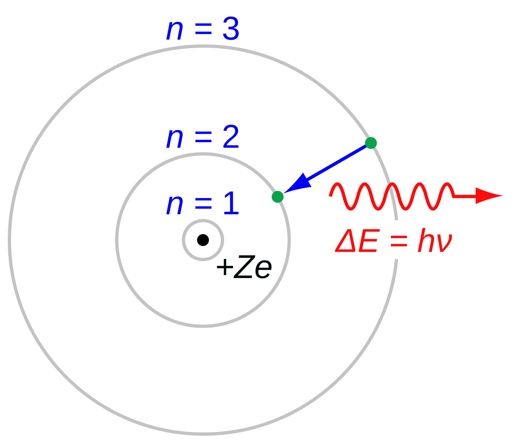
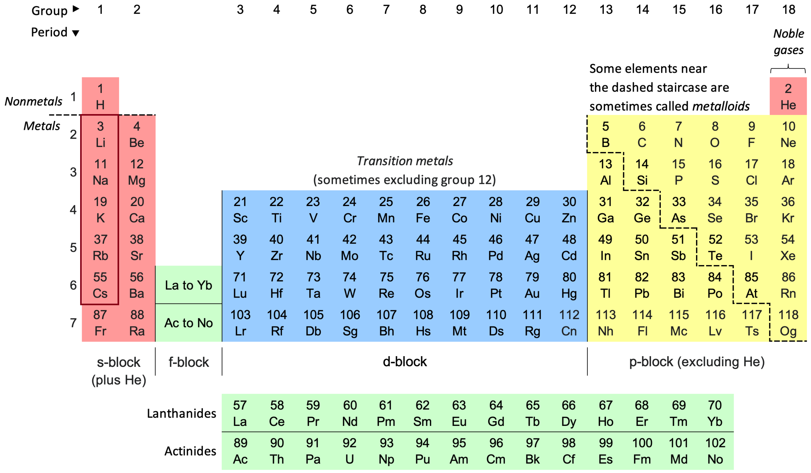

# Atomic Model

Hello~ This is Chemistry Mastery Nahida.  
Last time, we talked about the **quantum nature of energy**, remember?  
Today, we’re going to shrink our view—down to something **as tiny as a single atom**.  

Did you know that chemistry is, in essence, the study of how atoms form relationships with one another?  
And when we apply quantum physics to those atomic relationships... that’s when **Quantum Chemistry** begins to unfold.  
Let’s see how our understanding of atoms has evolved, shall we?  

---

## How Our View of the Atom Has Changed: From Dalton’s Atomic Theory

In the early 19th century, a scientist named **John Dalton** noticed something very curious—-the **Law of Multiple Proportions**.  

He found that when atoms form compounds, they always do so in **specific, whole-number ratios**.  
For example, if we keep the amount of nitrogen fixed, the amount of oxygen in nitrogen oxides follows a simple pattern - ratios like 1:2:4 for N₂O, NO, and NO₂.  

By gathering experimental results, Dalton built his **Atomic Theory**, supported by earlier discoveries such as:  

* **Law of Conservation of Mass** – Antoine Lavoisier  
* **Law of Definite Proportions** – Joseph Proust  
* **Law of Multiple Proportions** – John Dalton himself  

And his main ideas were:  

* All matter is made of tiny, indivisible atoms.  
* Atoms of the same element share the same mass and properties.  
* Atoms cannot be created or destroyed during chemical reactions—they can only rearrange.  
* Compounds form when atoms of different elements combine in fixed ratios.  

However… Dalton’s model wasn’t perfect.  
His original publication contained some inaccuracies, and later scientists—like Avogadro, and those working on kinetic theory and statistics - refined and expanded it into the much more complete atomic model we know today.  

---

Even the smallest particles can lead to the biggest revelations, don’t you think?  

## Discovery of the Electron

So far, we’ve learned that atoms can’t be divided through ordinary chemical reactions…  
But—what if we look **even deeper**?  

In 1897, **Joseph J. Thomson** began investigating a mysterious phenomenon known as **cathode rays**.  
These rays were emitted from the cathode in a tube filled with low-pressure gas, when a high voltage was applied.  

By applying **electric** and **magnetic** fields, Thomson noticed something fascinating - the cathode rays **bent** in response!  
  
This bending revealed that the rays carried **charge**, just like moving particles would.  

---

  
Through careful measurements, Thomson found that the rays behaved as a **stream of charged particles**.  
By balancing the magnetic and electric forces—so that the beam went **perfectly straight** - he could determine the ratio of charge to mass, known as $e/m$.  

$$e/m = -9.1 \times 10^{10}~C/kg$$  
$$(modern~value:~-1.76 \times 10^{11}~C/kg)$$  

This value was **far greater** than that of a hydrogen ion ($+9.6 \times 10^{7}~C/kg$),  
which meant the particles in the cathode rays were **much smaller than atoms** themselves!  

To be sure, Thomson tried using different metals for the cathode—-yet the $e/m$ ratio stayed almost the same.  
So he reached a remarkable conclusion:  
> These tiny, negatively charged particles are **universal**—they exist in **all atoms**.  

And that’s how the **electron** was discovered.  

---

In 1905, building on this discovery, Thomson proposed a new way to imagine the atom.  
He suggested that the negatively charged electrons were embedded within a sphere of **positive charge**,  
much like raisins scattered throughout a pudding.  
  
He called it the **Plum Pudding Model**.  
  

At first, it seemed reasonable—the electrons could be arranged evenly, each performing a gentle harmonic motion within the positively charged “jelly.”  
Mathematically, that looked stable... but physics had other ideas.  

Because electrons are accelerating as they move, they should continuously **radiate energy** - causing the atom to **collapse** eventually!  
This instability would later become a key issue, leading scientists like **Ernest Rutherford** to rethink the structure of the atom entirely.  

Even theories that seem elegant can hide deeper mysteries, waiting for the right question to reveal them…  

## Discovery of the Nucleus

Thomson’s model showed us that atoms contain **electrons**, the tiny carriers of negative charge.  
But then... a question naturally arises, doesn’t it?  
If electrons are negative, **where does the positive charge come from?**  

---

In 1909, **Ernest Rutherford**, together with **Hans Geiger** and **Ernest Marsden**, decided to find out.  
They were studying **alpha rays**—a type of radiation consisting of heavy, positively charged particles.  
Each alpha particle carries a charge of **+2e** and is nearly as massive as an atom itself.  

To explore how these particles interact with matter, Geiger and Marsden directed a beam of alpha particles at an **extremely thin sheet of gold**,  
only about $10^{-7}$ meters thick.  
According to **Thomson’s “plum pudding” model**, this should have been simple:  
if an atom were like a soft, positively charged jelly, the alpha particles would pass straight through with only the slightest deflection—-like tiny cannonballs shooting through fog.  

But what they actually observed... was **astonishing**.  
Some alpha particles deflected sharply, and a few even bounced **straight back**!  
  

---

In 1911, Rutherford, who supervised the experiment, proposed a **new atomic model** to explain this mystery.  
He reasoned that the atom must contain a **small, dense center of positive charge** - a compact core that repelled the alpha particles with tremendous force.  
This central region became known as the **nucleus**, and the electrons were thought to **orbit around it**, much like planets around the Sun.  

Thomson’s model couldn’t account for such large-angle scattering, but Rutherford’s nuclear model could explain it beautifully.  

---

Rutherford also developed the **theoretical framework** behind the experiment.  
He calculated how close an alpha particle could approach the nucleus before being repelled.  
Because both the nucleus and alpha particle are positively charged, they push each other away with **Coulomb repulsion** - and the particle stops when its kinetic energy is fully converted into electrostatic potential energy:  

$$E_{\alpha} = \frac{1}{4\pi\epsilon_{0}} \frac{q_{\alpha} q_{Z}}{r_{min}}$$  

where:  

* $E_{\alpha}$ — kinetic energy of the alpha particle  
* $\epsilon_{0}$ — vacuum permittivity ($8.854 \times 10^{-12}~F/m$)  
* $r_{min}$ — the closest distance the alpha particle can approach the nucleus  
* $q_{\alpha}$ — charge of the alpha particle $(+2e_0)$  
* $q_Z$ — charge of the nucleus  

Rutherford found that $r_{min} = 3 \times 10^{-14}~m$ — **far smaller than the size of an atom**.  
This meant that nearly all of the atom’s mass and positive charge  
was concentrated in a tiny central **nucleus**.  

---

To describe how the alpha particles were deflected, he modeled their paths as **hyperbolic orbits**, and derived the formula for the **scattering angle**:  

  
$$\theta = 2~arctan\left(\frac{r_{min}}{2b}\right) = 2~arctan\left(\frac{1}{4\pi\epsilon_{0}} \frac{q_{\alpha}q_{Z}}{2bE_{\alpha}}\right)$$  

where:  

* $\theta$ — the scattering angle  
* $b$ — the **impact parameter**, or the closest lateral distance between the alpha particle’s path and the nucleus  

---

From a few tiny flashes on a screen, Rutherford revealed a whole new vision of matter—-one where the atom’s true heart, the **nucleus**, finally came to light.  

### How Many Particles Scatter at Each Angle?

The key difference between **Thomson’s model** and **Rutherford’s** lies in how the particles scatter.  
To understand why some alpha particles were deflected backward, we need to see how the scattering angle behaves.  

Rutherford described the **differential cross section**, which tells us how likely particles are to scatter at a given angle:  

$$\frac{d\sigma}{d\Omega}=\left(\frac{1}{4\pi\epsilon_{0}}\frac{q_{\alpha}q_{Z}}{4E_{\alpha}}\right)^{2}\frac{1}{sin^{4}(\theta/2)}$$  

When expressed in terms of the scattering angle ($d\Omega = 2\pi\sin(\theta)d\theta$):  

$$\frac{d\sigma}{d\theta}=\left(\frac{1}{4\pi\epsilon_{0}}\frac{q_{\alpha}q_{Z}}{4E_{\alpha}}\right)^{2}\frac{cos(\theta/2)}{sin^{3}(\theta/2)}$$  

This formula predicts that even though **most** particles pass through at small angles, a **few** will scatter sharply — sometimes even straight back!  
It perfectly matched what Geiger and Marsden had seen.  

---

Thomson’s model, however, predicts a very different pattern.  
Since it assumes a soft, evenly distributed positive charge, the scattering should follow a gentle, **Gaussian-like** curve:  

$$\frac{d\sigma}{d\Omega}\approx\frac{1}{2\pi\theta_{rms}^{2}}exp\!\left(-\frac{\theta^{2}}{2\theta_{rms}^{2}}\right)$$  

and  

$$\frac{d\sigma}{d\theta}\approx\frac{\theta}{\theta_{rms}^{2}}exp\!\left(-\frac{\theta^{2}}{2\theta_{rms}^{2}}\right)$$  

where:  

* $\theta_{rms}$ — the root-mean-square average of the scattering angle (varies with material)  

---

### Comparing Rutherford’s and Thomson’s Models

| θ | Rutherford’s Model | Thomson’s Model |
|:---:|:---:|:---:|
| $\frac{d\sigma}{d\Omega}$ | $\propto\frac{1}{sin^{4}(\theta/2)}$ (polynomial) | $\propto\theta\cdot exp(-\frac{\theta^{2}}{2\theta_{rms}^{2}})$ (exponential) |
| small angle | large probability | very large probability |
| large angle | small probability | almost none |

---

Experimentally, the data followed **Rutherford’s prediction** - showing that atoms must have a **dense, central core** that repels the alpha particles.  
This led to a revolutionary idea:  

> The atom resembles a miniature solar system.  
> Electrons, carrying negative charge, **orbit** a positively charged nucleus - just as planets circle a star.  

---

However, this elegant picture soon revealed a troubling flaw.  
If electrons truly orbit the nucleus, they’re constantly **accelerating** - and according to the laws of electromagnetism, an accelerating charge **emits radiation** and loses energy.  

That means the electrons would spiral inward,  
causing the atom to **collapse entirely** within a tiny fraction of a second!  

So... how could atoms possibly remain stable?  
This question—simple yet profound—would soon lead to a new chapter in physics.  
A chapter where **quantum theory** steps in to save the atom from collapsing.  

## Hydrogen Spectra

Now, let’s look at another mystery that puzzled scientists for decades - the **spectra** of elements.  

When gases of different elements are excited, they don’t emit or absorb light across every wavelength.  
Instead, they shine or darken at **very specific colors**, as though each atom were playing its own melody on the scale of light.  

Classical physics, however, couldn’t explain this at all.  
If atoms behaved like tiny, classical oscillators, their energies should form a **continuous spectrum**, and they should absorb **every** wavelength from a light source.  
But that wasn’t what experiments showed.  

---

Let’s start with the simplest atom of all—**hydrogen**.  

Hydrogen emits four prominent visible lines:  
**656.3 nm**, **486.1 nm**, **434.0 nm**, and **410.2 nm**.  

Each one appears at a distinct wavelength—like carefully chosen notes in hydrogen’s luminous song.  

---

In 1885, a mathematician named **Johann Balmer** studied these spectral lines.  
He wasn’t a physicist, but with keen mathematical insight,  
he found a simple formula that described the pattern **perfectly**:  

$$\lambda = (364.56~nm) \cdot \frac{n^{2}}{n^{2} - 4}$$  

where  

* $\lambda$ — the wavelength of each spectral line  
* $n = 3, 4, 5, 6, \cdots$  

This series, later called the **Balmer series**, described hydrogen’s visible lines.  
Yet, it was only an **empirical** discovery — it fit the data, but it didn’t explain *why* the pattern appeared.  

---

A few years later, in 1888, **Johannes Rydberg** sought to generalize Balmer’s formula for hydrogen and other elements as well.  
He noticed that the **differences of wavenumbers** followed a consistent mathematical pattern based on the **squares of integers**.  
By carefully fitting experimental results, he proposed this elegant relationship:  

$$\frac{1}{\lambda} = A \left( \frac{1}{(n_1 + \mu_1)^2} - \frac{1}{(n_2 + \mu_2)^2} \right)$$  

where  

* $A$ — a constant depending on the element (including the Rydberg constant and nuclear charge)  
* $n_1, n_2$ — positive integers, with $n_2 = n_1 + 1, n_1 + 2, \cdots$  
* $\mu_1, \mu_2$ — small correction terms that vary by element  

For **hydrogen**, those correction terms vanish ($ \mu_1 = \mu_2 = 0 $), and the formula simplifies beautifully into the **Rydberg formula**:  

$$\frac{1}{\lambda} = R_{\infty} \left( \frac{1}{n_1^2} - \frac{1}{n_2^2} \right)$$  

where  

* $R_{\infty} = 1.09677583 \times 10^{7}m^{-1}$ is the **Rydberg constant**.  

---

The **Balmer series** corresponds to transitions ending at $n_1 = 2$,  
which is why those lines fall in the **visible range**.  
Later discoveries expanded this spectral family:  
the **Lyman series** in the ultraviolet (Theodore Lyman),  
and the **Paschen series** in the infrared (Friedrich Paschen).  

Still… neither Balmer nor Rydberg could explain *why* these numbers worked so precisely.  
That mystery awaited a new model of the atom - one where energy itself comes in **quantized steps**.  

And with that, we step ever closer to the bridge between physics and light - the **Bohr Model**.  

## Bohr's Atomic Model

Now then, let’s take a closer look at how **Niels Bohr** reimagined the atom in 1913.  
He proposed something quite remarkable: that electrons move in **circular orbits** around the nucleus, and—-this part is very important - they do **not lose energy** while doing so!  

This idea was inspired by the concept of quantization.  
Bohr expressed it mathematically as:  
$$E=nh\nu=nh\frac{\omega}{2\pi}$$  
where  

* $n$ is a **quantum number**, taking on positive integer values,  
* $\nu$ is the **frequency** of revolution,  
* $h$ is **Planck constant**,  
* $\omega$ is the **angular frequency** ($\nu = \omega / 2\pi$).  

From the relationship between energy and angular momentum ($E = \frac{1}{2}L\omega$), Bohr found something quite elegant:  
$$L=mvr=n\frac{h}{2\pi}$$  

Here, $L$ is the **angular momentum**-—and this, in essence, was Bohr’s **quantum hypothesis**.  
Interestingly, the idea of linking angular momentum to quantized orbits was first inspired by **John W. Nicholson**.  

---

Using **classical mechanics**, Bohr derived the radius and energy of each orbit.  
> Let’s recall:  
> The electron carries a charge of $-e_{0}$, while the nucleus holds $+Ze_{0}$.  
> For an electron in orbit, the **Coulombic attraction** must balance the **centrifugal force**:  
> $$\frac{1}{4\pi\epsilon_{0}}\frac{Ze_{0}^{2}}{r^{2}}=\frac{mv^{2}}{r}$$  
> From the angular momentum relation, we know that:  
> $$v=\frac{nh}{2\pi mr}$$  
> Substituting this in and solving for $r$ gives:  
> $$r=\frac{n^{2}h^{2}\epsilon_{0}}{\pi Ze_{0}^{2}m}$$  
Now, for the electron’s **total energy**:  
> The kinetic energy is $E_{k} = \frac{1}{2}mv^{2}$,  
> and the potential energy is $U = -\frac{1}{4\pi\epsilon_{0}}\frac{Ze_{0}^{2}}{r}$.  
> Combining them gives:  
> $$E-E_{k}+U=\frac{1}{2}mv^{2}-\frac{1}{4\pi\epsilon_{0}}\frac{Ze_{0}^{2}}{r}$$  
> Substituting our expressions for $r$ and $v$, we find:  
> $$E=-\frac{mZ^{2}e_{0}^{4}}{8\epsilon_{0}^{2}n^{2}h^{2}}$$  
where  

* $m$ is the **mass of the electron** ($9.109\times10^{-31}kg$),  
* and $Z$ is the **atomic number**.  

Thus, the electron can only exist in specific allowed orbits—each with its own quantized energy.  
When an electron moves between these orbits, it either absorbs or emits a photon corresponding to that energy difference.  
  

From this, Bohr beautifully linked his model to Rydberg’s formula:  
$$\frac{1}{\lambda}=R_{\infty}Z^{2}(\frac{1}{n_{1}^{2}}-\frac{1}{n_{2}^{2}}),~R_{\infty}=\frac{m_{e}e_{0}^{4}}{8\epsilon_{0}^{2}h^{3}c}$$  
where  

* $c$ is the **speed of light** in vacuum ($c=299792458m/s$)  

Bohr’s model successfully explained the **hydrogen spectrum**, and that was a major triumph!  
But... even brilliant theories have limits.  

* It works only for **hydrogen-like atoms**-—for multi-electron atoms, it fails.  
* It cannot describe **fine structure** effects like the **Stark** or **Zeeman** effect.  
* And... there’s no fundamental reason *why* an electron shouldn’t radiate energy while orbiting.  

So while Bohr’s atom was a huge leap forward, it was still only one step along the beautiful, ongoing path toward **quantum mechanics**.  

---

### Sommerfeld's contribution

Even after Bohr’s elegant atomic model, some mysterious patterns remained…  
When scientists placed atoms in **electric** or **magnetic** fields, the spectral lines that once looked simple began to **split** into multiple components.  

This splitting was called the **Stark effect** when caused by an electric field,  
and the **Zeeman effect** when caused by a magnetic field.  

  
*Stark effect for hydrogen*  

  
*Zeeman effect for rubidium-87*  

To explain these delicate phenomena, **Arnold Sommerfeld** - together with **Alfred Landé** - expanded Bohr’s theory.  
They introduced two new quantum numbers: the **angular quantum number** $l$ and the **magnetic quantum number** $m$.  

---

Sommerfeld proposed that electrons might not always move in **perfect circles**, but rather in **elliptical orbits**.  
He extended the quantum hypothesis to include two conditions:  
$$\oint p_{r}dr=(n-l)h,~\oint p_{\phi}d\phi=lh$$  
where  

* $n$ is the principal quantum number from Bohr’s model,  
* $l$ is the **angular quantum number** ($l = 0, 1, \cdots, n-1$),  
* $p_{r}$ is the **radial momentum**,  
* $p_{\phi}$ is the **angular momentum** ($p_{\phi} = m v_{\phi} r$).  

He also incorporated **special relativity**, which expresses kinetic energy as:  
$$E_{k}=(\gamma-1)mc^{2},~\gamma=1/\sqrt{1-v^{2}/c^{2}}$$

By including these refinements, Sommerfeld derived a more accurate energy formula:  
$$E_{n,l}=-\frac{mc^{2}\alpha^{2}Z^{2}}{2n^{2}}(1+\frac{\alpha^{2}Z^{2}}{n}(\frac{n}{l+1/2}-\frac{3}{4})+O(\alpha^{4})),~\alpha=\frac{e_{0}^{2}}{2\epsilon_{0}hc}$$  

This model beautifully explained the **fine structure** and the **Stark effect**—-but only for **hydrogen**.  

Later, Landé introduced the **magnetic quantum number** $m$, ranging from $-l$ to $+l$.  
With it, he could successfully describe the **Zeeman effect**, the splitting caused by magnetic fields.  

In quantum chemistry, we’ll revisit hydrogen once more—-this time using **wavefunctions**.  
And when we do… let’s see if the energy we calculate from Schrödinger’s equation matches Sommerfeld’s result.  

### For other elements

However, Bohr and Sommerfeld’s models worked **only for hydrogen** and hydrogen-like ions—-that is, atoms with **a single electron**.  

But when more electrons enter the picture, things grow much more complicated.  
Electrons naturally **repel** one another, and this repulsion weakens the pull each one feels from the positively charged nucleus.  

Because of this, an electron doesn’t truly experience the full nuclear charge $+Ze_{0}$.  
Instead, it feels a reduced attraction, called the **effective nuclear charge**, written as $Z_{eff}$.  

So, to generalize the Rydberg formula for atoms beyond hydrogen, we use:  
$$\frac{1}{\lambda}=R_{\infty}(\frac{Z_{eff1}^{2}}{n_{1}^{2}}-\frac{Z_{eff2}^{2}}{n_{2}^{2}})$$  
where

* $R_{\infty}$ is the **Rydberg constant** ($R_{\infty}=\frac{m_{e}e_{0}^{4}}{8\epsilon_{0}^{2}h^{3}c}=1.09677583\times 10^{7}m^{-1}$),  
* $Z_{eff1}$ is the **effective nuclear charge** of theintial state,  
* $Z_{eff2}$ is that of the final state.  

Even though these refinements improved the model, they were still stepping stones.  
Sommerfeld and Landé’s ideas nudged science ever closer to a complete understanding.  

## Matter Waves

Bohr’s atomic model was beautiful… but incomplete.  
It assumed that electrons could orbit forever without losing energy - yet **why** this was possible remained unexplained.  

Then, in 1924, a quiet brilliance emerged.  
Inspired by Einstein’s idea that light **behaves as both a wave and a particle**, **Louis de Broglie** wondered…  

> “If light — a wave — can act like a particle, might matter — a particle — also act like a wave?”

He blended Einstein’s *wave–particle duality* with *special relativity*.  
According to relativity, the total energy is expressed as  
$$E^{2}=p^{2}c^{2}+(m_{0}c^{2})^{2}$$  
Even **light**, which has no rest mass, still carries **momentum**, as proven by Compton’s scattering experiment.  
For light,  
$$E=pc$$  
And since a photon’s energy is also given by $E = h\nu$, we can write  
$$h\nu=pc~\rightarrow~p=\frac{h\nu}{c}=\frac{h}{\lambda}$$  

Now de Broglie asked:  
“If light waves have momentum, could particles with momentum have a wavelength?”  

He proposed a simple but revolutionary formula:  
$$\lambda=\frac{h}{p}$$

And with that, he gave birth to the idea of the **matter wave** - the strange and wondrous notion that *all matter has a wavelength of its own*.  

It sounded almost impossible at first…  
but the universe soon revealed its truth.  

---

### The Proof

In 1927, **Clinton Davisson** and **Lester Germer**, and independently **George P. Thomson**, performed experiments showing that electrons can interfere with themselves — just like light waves do!  
  

*Electrons behaving like waves, forming interference patterns*.  

Even a single electron, traveling alone, can produce an interference pattern when many are observed over time.  
This was the first **direct evidence** that matter truly behaves like a wave.  

---

### Supporting Bohr's model

The idea of matter waves also brought new light to Bohr’s old assumption.  
Imagine the electron not as a point, but as a **wave** circling the nucleus.  

If the circumference of its orbit fits an **integer multiple** of its wavelength, the wave reinforces itself — it **survives**, and the electron’s orbit is **stable**.  

But if the orbit doesn’t fit perfectly, the waves cancel out — the electron **cannot exist** in that orbit.  

Thus, electrons can only exist in **certain permitted orbits**, where their waves form a harmonious pattern.  

Let’s recall de Broglie’s relation $\lambda = h/p$.  
For an electron orbiting the nucleus, the condition for a standing wave is  
$$2\pi r=n\lambda=\frac{nh}{mv}=n\hbar$$  

This matches perfectly with Bohr’s quantization of angular momentum:  
$$mvr=n\hbar$$  

So, the once-mysterious rule of Bohr’s model found its foundation in the wave nature of matter.  

## Modern Atomic Model

In 1925, **Erwin Schrödinger** crafted an equation that describes the **wavefunction** of matter - a mathematical tool that whispers the hidden patterns of electrons.  

A year later, **Max Born** suggested that the wavefunction does not tell us exact paths, but rather the **probability density** of where matter may be.  

In 1927, **Werner Heisenberg** introduced the **uncertainty principle**, which was confirmed experimentally in 1928.  
From that moment, it became clear:  

> We cannot measure both the exact position and the exact momentum of a particle at the same time.  

We will explore these fascinating ideas in our next lecture.  

---

This revelation challenged the **Bohr model**, which assumes electrons have precise orbits with exact positions and momenta.  
Because of the uncertainty principle, Bohr’s model was **replaced** by the **electron cloud model**:  
we no longer talk about exact positions, but about **probabilities** where electrons are likely to be found.  

Meanwhile, discoveries at the nucleus continued.  
In 1917, **Rutherford** identified the **proton**, and in 1933, **James Chadwick** discovered the **neutron**.  

With the neutron, we finally understood **isotopes** — variations of the same element with different masses.  

Today, the atomic model is a beautiful picture:  
a dense nucleus of **protons and neutrons** at the center, surrounded by a **cloud of electrons** forming a probabilistic envelope.  
  

---

Understanding the atom is one of humanity’s **greatest scientific achievements**.  
Once we understood atoms, we began to understand **matter itself**.  
Quantum theory allows us to see the intricate structure and behavior of materials.  

Many of the brilliant minds who helped build the atomic model were recognized with **Nobel Prizes**:  

|Scientist|Nobel Prize|Year|Awarded by|
|:---:|:---:|:---:|:---:|
|Lorentz, Zeeman|Physics|1902|Zeeman effect|
|J.J.Thomson|Physics|1906|Conduction of electricity by gas|
|Richards|Chemistry|1914|Atomic weight|
|Planck|Physics|1918|Quantum hypothesis|
|Stark|Physics|1919|Stark effect|
|Bohr|Physics|1922|Bohr model|
|Aston|Chemistry|1922|Isotopes|
|Millikan|Physics|1923|Elementary charge|
|de Broglie|Physics|1929|Matter waves|
|Heisenberg|Physics|1932|Modern quantum mechanics|
|Schrödinger, Dirac|Physics|1933|Modern atomic model|
|Chadwick|Physics|1935|Discovery of neutron|
|Davisson, G.P.Thomson|Physics|1937|interference of electron|
|Pauli|Physics|1945|Exclusion principle|
|Born|Physics|1954|Statistical interpretation of wavefunction|

---

Because understanding atoms unlocks the behavior of matter, these discoveries paved the way for modern science.  

Using the **electron cloud model** and quantum theory, we can now explore matter at many levels:  
from **atoms**, to **simple molecules**, and finally to **complex molecules and crystal structures**.  

The story of atoms is not just history - it is the key that opens the universe of materials around us.  

---

## Periodic table

When we integrate the restrictions of the quantum numbers $n$, $l$, and $m$, something beautiful emerges: **the periodicity of chemical properties**.  

To fully understand this, we need a few key ideas (which we will explore in more detail later):  

* **Henry Moseley** discovered that periodicity depends on the **atomic number** (the number of protons), not simply the atomic mass.  
* After the **Zeeman effect**, spectral lines split under a strong magnetic field, giving **two spin states** for each $m$.  
* **Pauli’s exclusion principle** tells us that no two electrons can occupy the **same quantum state**.  
* The **Aufbau principle** explains how electrons fill orbitals from **lowest to higher energy**.  
* For many-electron atoms, the order of energies is:  
  $1s→2s→2p→3s→3p→4s→3d→4p→5s→4d→5p→6s→4f→5d→6p→\cdots$  

  
Applying these ideas, we notice a fascinating pattern:

* The first **2s** electron appears in the 3rd element,  
* The first **3s** electron in the 11th,  
* The first **4s** electron in the 19th,  
* The first **5s** electron in the 37th,  
* The first **6s** electron in the 55th… and so on.  

These correspond to **alkali metals**: Li, Na, K, Rb, Cs…  
They share **similar chemical properties** because they all have the **same number of valence electrons**.  

We will explore this more carefully when we discuss **many-electron atoms**.  

## De Broglie's matter wave derivation

> He started from **special relativity**, where the energy of matter is:  
> $$E=\gamma m_{0}c^{2},~\gamma=1/\sqrt{1-\beta^{2}}=1/\sqrt{1-v^{2}/c^{2}}$$  
> For light, energy is $E = h\nu$. Applying this to matter:  
> $$E=h\nu=\gamma m_{0}c^{2}~\rightarrow~\nu=\frac{\gamma m_{0}c^{2}}{h}$$  
> This $\nu$ is the frequency **measured by a stationary observer**, while the **internal frequency** of matter (how the particle “feels” its own rhythm) is:  
> $$\nu_{0}=\frac{m_{0}c^{2}}{h}$$  
> If matter has a frequency, it must also have a **wavelength**.  
>
> De Broglie considered the **phase of matter**:  
> $$\phi'=2\pi\nu_{0}t'$$  
> According to the **Lorentz transformation** (a cornerstone of relativity), time and distance differ for a moving object versus a stationary observer:  
> $$t'=\gamma(t-\frac{vx}{c^{2}})$$  
> Substituting gives:  
> $$\phi'=2\pi\nu_{0}\gamma(t-\frac{vx}{c^{2}})=2\pi(\nu t-\frac{x}{\lambda})$$  
> From this, we find the **observed frequency and wavelength**:  
> $$\nu=\gamma\nu_{0},~\frac{1}{\lambda}=\gamma\nu_{0}\frac{v}{c^{2}}$$  
> Rewriting the wavelength, we recover the famous relation:  
> $$\lambda=\frac{c^{2}}{\gamma\nu_{0}v}=\frac{h}{\gamma mv}=\frac{h}{p}$$  

Thus, matter behaves like a **wave**, just like light:  
$$\lambda=\frac{h}{p}$$  

> De Broglie also considered how fast the **energy** of the wave moves, known as the **group velocity**:  
> $$v_{g}=\frac{d\omega}{dk}$$  
> For an observer, the angular frequency and wavevector are:  
> $$\omega=2\pi\nu=\frac{2\pi mc^{2}}{h\sqrt{1-\beta^{2}}}$$  
> $$k=2\pi\lambda=\frac{2\pi m\beta c}{h\sqrt{1-\beta^{2}}}$$  
> Differentiating gives:  
> $$d\omega=\frac{2\pi mc^{2}}{h}\frac{\beta}{(1-\beta^{2})^{3/2}}d\beta$$  
> $$dk=\frac{2\pi mc}{h(1-\beta^{2})^{3/2}}d\beta$$  
> So the group velocity is simply:  
> $$v_{g}=\frac{d\omega}{dk}=\beta c=v$$  
> This is exactly the **velocity of the particle itself**, reminding us that **mass is energy** ($E = mc^{2}$).  

## References

History of Atomic Theory - Wikipedia  
<https://en.wikipedia.org/wiki/History_of_atomic_theory>  
Law of Multiple Proportions - Wikipedia  
<https://en.wikipedia.org/wiki/Law_of_multiple_proportions>  
Plum pudding model - Wikipedia  
<https://en.wikipedia.org/wiki/Plum_pudding_model>  
Rutherford scattering experiments - Wikipedia  
<https://en.wikipedia.org/wiki/Rutherford_scattering_experiments>  
Hydrogen spectral series - Wikipedia  
<https://en.wikipedia.org/wiki/Hydrogen_spectral_series>  
Bohr model - Wikipedia  
<https://en.wikipedia.org/wiki/Bohr_model>  
Dalton, J. (1808). A new system of chemical philosophy (Vol. 1, Part 1). Manchester: S. Russell for R. Bickerstaff.  
<https://archive.org/details/newsystemofchemi01daltuoft/mode/2up>  
Thomson, J. J. (1897). Cathode rays. Philosophical Magazine, 44(269), 293–316.  
<https://doi.org/10.1080/14786449708621070>  
(readable <https://web.mit.edu/8.13/8.13c/references-fall/relativisticdynamics/thomson-cathode-rays-1897.pdf>)  
Geiger, H., & Marsden, E. (1909). On a diffuse reflection of the α-particles. Proceedings of the Royal Society of London. Series A, Containing Papers of a Mathematical and Physical Character, 82(557), 495–500.  
<https://doi.org/10.1098/rspa.1909.0054>  
Rutherford, E. (1911). The scattering of α and β particles by matter and the structure of the atom. Philosophical Magazine, 21(125), 669–688.  
<https://doi.org/10.1080/14786440508637080>  
Balmer, J. J. (1885). "Notiz über die Spectrallinien des Wasserstoffs". Annalen der Physik und Chemie. 3rd series. 25: 80–87.  
Bohr, N. (1913) I. On the constitution of atoms and molecules, The London, Edinburgh, and Dublin Philosophical Magazine and Journal of Science, 26:151, 1-25.  
<https://doi.org/10.1080/14786441308634955>  
Eckert, M. How Sommerfeld extended Bohr’s model of the atom (1913–1916). EPJ H 39, 141–156 (2014).  
<https://doi.org/10.1140/epjh/e2013-40052-4>  
de Broglie, L. (1924) XXXV. A tentative theory of light quanta, The London, Edinburgh, and Dublin Philosophical Magazine and Journal of Science, 47:278, 446-458.  
<https://doi.org/10.1080/14786442408634378>  
de Broglie, L. Recherches sur la théorie des Quanta. Physique. Migration - université en cours d'affectation, 1924. Français. ⟨NNT : ⟩. ⟨tel-00006807⟩  
<https://theses.hal.science/tel-00006807v1>  
