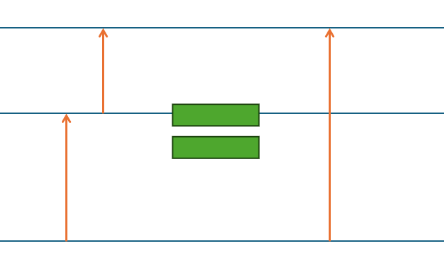

# Heisenberg's quantum mechanics

Hello, traveler of knowledge~ This is **Chemistry Mastery Nahida**.  
Last time, we explored how our picture of the atom slowly evolved through human curiosity.  
The **Bohr–Sommerfeld model** beautifully explained the hydrogen spectrum with its quantised angular momentum…  
but it couldn’t illuminate the subtle **fine structures** hiding behind the lines.  
Even de Broglie’s wave-like insight didn’t resolve that mystery.  

To reach deeper into the atom’s delicate heart, **modern quantum mechanics** had to be born.  

Three brilliant minds — **Werner Heisenberg**, **Erwin Schrödinger**, and **Paul Dirac** — each tried to express the quantum world in their own unique language.  

---

## Heisenberg's insight

Werner Heisenberg, still so young at the time (born in 1901), made a surprisingly bold suggestion:  

> *“What if there were no orbits to begin with?”*  

He thought Bohr’s model struggled precisely because it **assumed** something we never actually observe:  
the electron’s orbit.  

So Heisenberg created a new foundation for quantum mechanics —  
one built **only from observable quantities**, not imagined paths.  
It was a daring idea, and it changed everything.  

He used wonderfully clever mathematics, expressing physical quantities as **matrices**.  

In his famous *Umdeutung* (*reinterpretation*) paper, he wrote things like:  
$$p=\{p_{nm}\},\quad x=\{x_{nm}\}$$  

He connected observable transitions between quantum numbers \(n\) and \(m\).  
Time dependence enters through a **discrete Fourier expansion**:
$$A=\sum_{n,m} A_{nm} e^{2\pi i\nu_{nm} t}$$

(Yes—Fourier transforms appear everywhere in physics. They let us rewrite time-behavior as a “song” of frequencies~)  
  
Fourier transformation  

Position is written as:  
$$x(t)=\sum_{n,m} x_{nm} e^{2\pi i\nu_{nm} t}$$  
Matrix form:  
$$X(t)=(x_{nm}e^{2\pi i\nu_{nm}t})$$  

What about $x^{2}$?  
Well… it’s simply:  
$$(X(t))^{2}=X(t)X(t)=(\sum_{k}x_{mk}x_{kn}e^{2\pi i(\nu_{nk}+\nu_{kn})t})$$  

And for products:  
$$(xy)_{nm}=\sum_k x_{nk}y_{km}e^{2\pi i(\nu_{nk}+\nu_{km})t},\qquad (yx)_{nm}=\sum_k y_{nk}x_{km}e^{2\pi i(\nu_{nk}+\nu_{km})t}$$  

Just like ordinary matrices, $xy\neq yx$.  
This non-commutativity whispers the quantum nature hidden inside.  

---

## Bohr-Sommerfeld model

## Bohr–Sommerfeld model

Before Heisenberg, the Bohr–Sommerfeld quantisation condition was:  
$$2\pi J=\oint p\,dx = nh$$  

Here, $J$ is the action — the nature’s “preferred route” minimising $\int Ldt$, where $L=T-V$ is Lagrangian.  
Let me gently remind you:  

> Bohr used the periodic-action formula ($J=\oint pdx$), so Heisenberg followed that notation.  
> My explanation here uses Hamiltonian mechanics, where the factor $2\pi$ is included already.  

Heisenberg wrote transition frequencies as:  
$$\nu(n,m)=\frac{E_n - E_m}{h}$$  

And he found a beautiful composition rule:  
$$\nu(n,m)=\nu(n,k)+\nu(k,m)$$  

Just as energy differences, frequencies can be added too~  
  

Classically, frequency satisfies:  
$$2\pi\nu(n,n-1)=\frac{dE}{dJ}$$  

Since quantum jumps are extremely small:  
$$\Delta J = J_n - J_{n-1} = \hbar$$  

Isn’t it lovely?  
Even **without orbits**, Heisenberg naturally retrieved the **Bohr–Sommerfeld hypothesis**.  

---

## Quantum harmonic oscillator (July 1925)

Now, let’s step further into the quantum garden—  
the **harmonic oscillator**, a tiny spring-like motion at the atomic scale.  

The classical equation is:  
$$\frac{d^2x}{dt^2}+\omega_0^2 x = 0$$  
with solution:  
$$x=a_1\cos(\omega_0 t)$$  

Heisenberg replaced the classical constants with quantum-indexed ones.  
After his careful matrix analysis, he arrived at this elegant energy expression:  
$$E=\frac{h\omega_0}{2\pi}\left(n+\frac{1}{2}\right)$$  

That means:  

* Energy is **quantised** in equal intervals $\hbar \omega_0$.  
* Even at the lowest state, the oscillator has **non-zero energy** — the **zero-point energy (ZPE)**.  

  

The quantum world never sits completely still…  
It always trembles with tiny fluctuations.  

---

## Born-Jordan quantisation postulate (September-November 1925)

**Max Born** and **Pascual Jordan** sought a bridge between classical action and Heisenberg’s new quantum rules.  

They proposed:  
$$\mathbf{x}\mathbf{p}-\mathbf{p}\mathbf{x}=\frac{ih}{2\pi}\mathbf{I}$$  

In the compact operator form:  
$$[x,p]=i\hbar$$  

This commutator is one of the most important seeds in all quantum theory.  
It states, very gently but firmly, that **order matters** in quantum operations.  

---

## Uncertainty principle (1927)

Heisenberg then asked a subtle question:  

> *If we measure something with limited accuracy, how does nature respond?*  

He studied probability amplitudes like $S(\eta,x)$, which behave as Gaussians:  
$$S(\eta,x)\propto\exp\!\left(-\frac{(x-x')^2}{2x_1^2}-\frac{2\pi i}{h}p'(x-x')\right)$$  

Switching to momentum using:  
$$S(x,p)=\langle x|p\rangle\propto e^{2\pi i px/h}$$  

he obtained the momentum distribution:  
$$S(\eta,p)=\int S(\eta,x)S(x,p)dx\propto\exp\!\left(-\frac{(p-p')^2}{2p_1^2}+\frac{2\pi i}{h}x'(p-p')\right)$$  

From here blooms the famous **uncertainty principle**:  
$$p_1 x_1 = \frac{h}{2\pi}$$  

Later refined into the standard form:  
$$\Delta x\,\Delta p \ge \frac{\hbar}{2}$$  

In quantum mechanics, some pairs of quantities simply refuse to be known perfectly at the same moment.  
It’s not a failure of our tools…  
It’s part of nature’s own poetry.  
  

---

## Heisenberg in chemistry

Chemists usually don’t *directly* use Heisenberg’s matrix mechanics —  
it feels a bit too **abstract** for describing molecules.  
No wavefunctions, no orbitals… it’s a little lonely for chemistry.  

Instead, we often use **Schrödinger’s equation**, which is mathematically equivalent but much more **intuitive**.  
Later chemists — like Linus Pauling and Kenichi Fukui — grew entire gardens of theory from Schrödinger’s orbitals.  

Still, Heisenberg’s ideas form the **foundation** beneath modern quantum chemistry.  
Without them, chemically important methods like Hartree–Fock could never have bloomed.  

---

## Derivation of quantum harmonic oscillator

He first wrote the position as  
$$x(n,t)=\sum_{\alpha}x(n,\alpha)e^{i\omega(n)\alpha t}$$  
and the action  
$$2\pi J=m\oint\dot x^{2}dt=2\pi m\sum_\alpha |x(n,\alpha)|^{2}\alpha^{2}\omega(n)$$  

Using Bohr–Sommerfeld:  
$$2\pi dJ = h dn$$  

And by Kramers’ quantisation rule:  
$$\alpha\frac{dA(n,\alpha)}{dn}=A(n+\alpha,n)-A(n,n-\alpha)$$  

The quantum Planck constant becomes:  
$$h_{quantum}=4\pi m\sum_{\alpha}\Big(|x(n,n+\alpha)|^{2}\omega(n,n+\alpha)-|x(n,n-\alpha)|^{2}\omega(n,n-\alpha)\Big)$$  

Next, assume:  
$$a_1=a(n,n-1),\quad \omega_0=\omega(n,n-1)$$  

Position becomes:  
$$x=\frac{a(n,n-1)}{2}e^{i\omega(n,n-1)t}+\frac{a(n-1,n)}{2}e^{i\omega(n-1,n)t}$$  

The amplitude satisfies:  
$$(a(n,n+1))^2-(a(n,n-1))^2=\frac{h}{\pi m\omega_0}=k$$  

With the boundary condition $a(0,-1)=0$:  
$$a(n,n-1)=\sqrt{\frac{nh}{\pi m\omega_0}}$$  

Total energy:  
$$E=T+V=\frac12m\dot x^2+\frac12 m\omega_0^2 x^2$$  
and the final result:  
$$E=\frac{h\omega_0}{2\pi}\left(n+\frac{1}{2}\right)$$  

---
## Derivation of Born-Jordan quantisation postulate

Hamilton’s equations:  
$$\dot{x}=\frac{p}{m},\qquad \dot{p}=-\frac{\partial U}{\partial x}$$  

Heisenberg expanded $p$ and $x$ in Fourier form:  
$$p=\sum_\tau p_\tau e^{2\pi i\nu\tau t},\quad x=\sum_\tau x_\tau e^{2\pi i\nu\tau t}$$  

Classical action:  
$$2\pi J=\int_{0}^{1/\nu}p\dot q dt$$  

From this,  
$$1=i\sum_{\tau}\tau\frac{\partial}{\partial J}(x_\tau p_{-\tau})$$  

Replacing the derivative with its quantum counterpart:  
$$\frac{1}{h}\sum_{\tau}[x(n+\tau,n)p(n,n+\tau)-x(n,n-\tau)p(n-\tau,n)]$$  

Finally:  
$$\sum_k[p(nk)x(kn)-x(nk)p(kn)] = \frac{h}{2\pi i}$$  
or simply:  
$$[\mathbf{p},\mathbf{x}] = -i\hbar\mathbf{I}$$  

---

## References

Umdeutung paper - Wikipedia  
<https://en.wikipedia.org/wiki/Umdeutung_paper>  
Matrix mechanics - Wikipedia  
<https://en.wikipedia.org/wiki/Matrix_mechanics>  
Uncertainty principle - Wikipedia  
<https://en.wikipedia.org/wiki/Uncertainty_principle>  
Heisenberg, W. (1925). Über quantentheoretische Umdeutung kinematischer und mechanischer Beziehungen. Zeitschrift für Physik, 33, 879–893.  
<https://doi.org/10.1007/BF01328377>  
Born, M., Jordan, P. Zur Quantenmechanik. Z. Physik 34, 858–888 (1925).  
<https://doi.org/10.1007/BF01328531>  
Born, M., Heisenberg, W. & Jordan, P. Zur Quantenmechanik. II.. Z. Physik 35, 557–615 (1926).  
<https://doi.org/10.1007/BF01379806>  
Heisenberg, W. Über den anschaulichen Inhalt der quantentheoretischen Kinematik und Mechanik. Z. Physik 43, 172–198 (1927).  
<https://doi.org/10.1007/BF01397280>  
